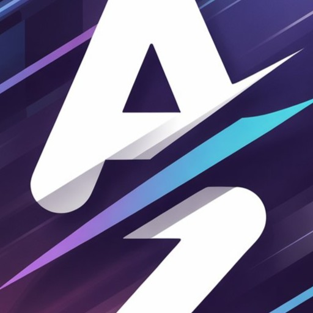
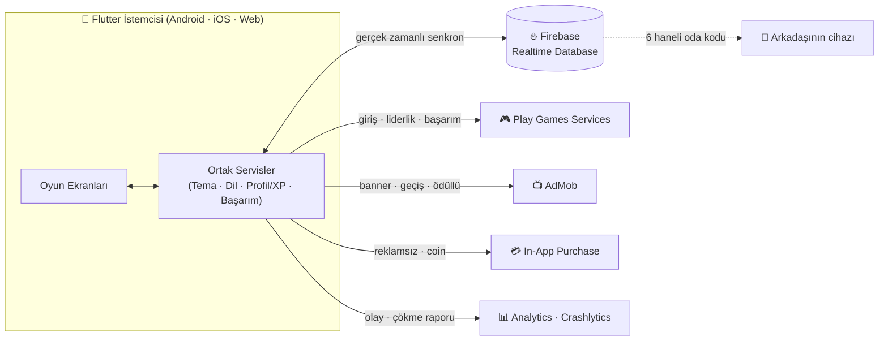

<div align="center">



# 🎮 AZ Oyun

### Arkadaşlarınla oyna. 30'dan fazla ücretsiz oyun. Tek uygulama.

[](https://flutter.dev)
[](https://dart.dev)
[](https://firebase.google.com)
[](#-teknoloji-yığını)
[](docs/ROADMAP.md)
[](#-katkıda-bulunmak-ister-misin)

**[🌐 Canlı Demo'yu Dene](https://azoyun.web.app)** &nbsp;·&nbsp; **[🗺️ Yol Haritası](docs/ROADMAP.md)** &nbsp;·&nbsp; **[🚀 Otomatik Yayınlama](docs/DEPLOY.md)**

</div>

---

## 🤔 AZ Oyun nedir?

Kurulum yok, hesap zorunluluğu yok, karmaşık menüler yok. **Bir isim gir, bir
oda kodu paylaş, oynamaya başla.** AZ Oyun; Dama'dan Among Us tarzı sosyal
çıkarım oyunlarına, klasik Okey'den kendi yazdığımız bir polisiye vaka
kampanyasına kadar **30'dan fazla oyunu** tek bir Flutter uygulamasında
birleştiren, arkadaşlarla eğlenmek için tasarlanmış bir oyun koleksiyonu.

Felsefemiz basit: **çok kazanmak değil, insanları eğlendirmek.** Agresif
reklam yok, "kazanmak için öde" yok, misafir olarak da oynanabilir.

## ✨ Öne Çıkanlar

| | |
|---|---|
| 🌍 **Gerçek zamanlı çok oyunculu** | Firebase Realtime Database ile 6 haneli oda kodu — arkadaşını davet et, aynı anda oyna |
| 📱 **Elden ele hızlı oyunlar** | Kurulum/oda gerektirmeyen, "aç ve oyna" tarzı 18 tek-cihaz oyunu |
| 🕵️ **Öykü tabanlı kampanya** | 5 vakalık orijinal bir dedektif hikâyesi — ipucu topla, şüpheliyi sorgula, doğru katili bul |
| 🏆 **XP, seviye, başarım** | Her maç ilerleme kazandırır; Google Play Games Services ile bulut senkron |
| 🎨 **Kişiselleştirilebilir tema** | Açık/Koyu/Telefonun Teması (Material You)/12 renklik özel tema seçeneği |
| 🌐 **6 dil desteği** | Türkçe, İngilizce, Almanca, Fransızca, İspanyolca, Rusça |
| 🧩 **Üç platform, tek kod tabanı** | Android, iOS ve Web — aynı Flutter kod tabanından |
| 🛡️ **Adil oyun ilkesi** | Reklam düşük sıklıkta, pay-to-win yok, hesapsız (misafir) oynanabilir |

## 📚 İçindekiler

- [Oyunlar](#-oyunlar)
- [Mimari](#-mimari)
- [Teknoloji Yığını](#-teknoloji-yığını)
- [Başlarken](#-başlarken)
- [Proje Yapısı](#-proje-yapısı)
- [Otomatik Dağıtım](#-otomatik-dağıtım)
- [Yol Haritası](#-yol-haritası)
- [Katkıda Bulunmak İster Misin](#-katkıda-bulunmak-ister-misin)

## 🎮 Oyunlar

### 🌍 Online — Arkadaşını Davet Et (Firebase, gerçek zamanlı)

Her biri 6 haneli bir oda koduyla çalışır: birisi oda açar, diğerleri kodu
girip katılır.

| Oyun | Açıklama |
|---|---|
| ⛳ **Mini Golf** | Sıra tabanlı, engelli parkurlarda serbest vuruş golfü |
| ⚽ **Serbest Vuruş** | Penaltı düellosu — kaleci hamlesini tahmin et |
| 🏁 **Araba Yarışı** | Senkronize geri sayım + gerçek zamanlı yarış fiziği |
| 🪢 **Adam Asmaca** | Klasik kelime oyunu, kendi kelimeni de yazabilirsin |
| 🏙️ **Şehir Bulmaca** | İpuçlarıyla şehri bil, en hızlı doğru cevap kazanır |
| 🔤 **Kelime Bulmaca** | Karışık harflerden en çok kelimeyi bul |
| 🀄 **Okey & Okey 101** | Gerçek el geçerliliği kontrolü, istaka, taş sıralama |
| ⚫ **Dama** | Gerçek Türk Dama kuralları — zorunlu zincirleme yakalama dahil |
| ⚔️ **Dövüşçüler** | 6 farklı karakter, özel yetenekler, 3 raunt |
| 🧛 **Vampir Köylü** | Doktor + Dedektif rolleriyle genişletilmiş "Werewolf" |
| ☕ **Yalancılar Kahvesi** | Kim yalan söylüyor? Sosyal çıkarım oyunu |
| 🚀 **Hain Kim?** | Among Us esintili görev + gizli hain + toplantı/oylama |

### ⚡ Hızlı Oyunlar — Aynı Cihazda, Sırayla

Kurulum yok, oda kodu yok — telefonu elden ele geçirerek oynanır.

`XOX` · `4'lü Bağlantı` · `Reversi` · `Nim` · `Taş Kağıt Makas` ·
`Hafıza Kartları` · `Çizgi Doldurma` · `Yılan` · `2048` ·
`Refleks Çarpışması` · `Kim Bilir? (Bilgi Yarışması)` ·
`Sayı Tahmin Düellosu` · `Balon Patlatma` · `Parti Zarı` ·
`Kayan Yapboz` · `Zıpla Geç` · `Renk Hafızası` · `Mini Bovling`

### 🕵️ Bonus: Gece Ekspresi Cinayeti

Heavy Rain esintili, 5 vakalık tam bir polisiye kampanya: olay yerini
incele, şüphelileri sorgula, kanıtları çelişkileriyle yakala ve doğru
suçluyu bul. Yanlış seçim de dahil her son, kendi hikâyesiyle kapanıyor.

## 🏗️ Mimari

Basit ve bilinçli bir tercih: **ayrı bir backend sunucusu yok.** Tüm
çok oyunculu mantık doğrudan Firebase Realtime Database üzerinde,
istemci tarafında çalışıyor.



Bu tercihin getirdiği disiplin: her online oyunun kendi ekran dosyasında
oda/lobi/oyun state'i Firebase dinleyicileriyle yönetiliyor, ortak
tekrarlanan mantık (`odadan çık`, `oda silindi → ana menüye dön`,
`SnackBar` yardımcıları vb.) `lib/core/` altında paylaşılan servis ve
widget'lara çıkarılmış durumda — ayrıntı için [`docs/ROADMAP.md`](docs/ROADMAP.md).

## 🛠️ Teknoloji Yığını

<div align="center">


</div>

- **Framework:** Flutter (Android · iOS · Web, tek kod tabanı)
- **Gerçek zamanlı veri:** Firebase Realtime Database
- **Kimlik & bulut ilerleme:** Google Play Games Services v2
- **Bildirimler:** Firebase Cloud Messaging + `flutter_local_notifications`
- **Gözlemlenebilirlik:** Firebase Analytics + Crashlytics
- **Gelir modeli:** Google Mobile Ads (AdMob) + `in_app_purchase` (reklamsız/coin/bağış)
- **Tema:** Material You dinamik renk (`dynamic_color`) + özel tema motoru
- **CI/CD:** GitHub Actions → Firebase Hosting (bkz. [`docs/DEPLOY.md`](docs/DEPLOY.md))

## 🚀 Başlarken

```bash
# 1. Depoyu klonla
git clone https://github.com/ferdidrgn/AZOyun.git
cd AZOyun

# 2. Bağımlılıkları yükle
flutter pub get

# 3. Çalıştır (bağlı cihaza/emülatöre göre)
flutter run                 # Android / iOS
flutter run -d chrome       # Web
```

> **Not:** Firebase entegrasyonu için kendi projenin `google-services.json`
> (Android) / `GoogleService-Info.plist` (iOS) dosyalarını ve
> `lib/core/config/firebase_options.dart` içindeki yapılandırmayı kendi
> Firebase projenle değiştirmen gerekir. Play Games Services / AdMob / IAP
> gibi mağaza servisleri de kendi Play Console / App Store Connect
> hesabında yeniden yapılandırılmalı.

## 📁 Proje Yapısı

```
lib/
├── core/
│   ├── services/        # Firebase, profil/XP, tema, dil, reklam, IAP...
│   ├── widgets/          # Paylaşılan UI bileşenleri (AZLeaveGuard, AZRoomHeader...)
│   ├── theme/            # AZTheme, renk paleti
│   ├── quickplay/        # 18 hızlı oyunun ortak "sırayla oyna" iskeleti
│   └── app_initializer.dart
├── features/
│   ├── <her-oyun>/       # Her online oyun kendi klasöründe (lobi + oda + oyun ekranı)
│   ├── quickgames/       # 18 hızlı oyunun ekranları
│   ├── mystery/          # Dedektif kampanyası
│   ├── profile/          # XP/başarım/istatistik dashboard'u
│   ├── onboarding/       # Splash + tanıtım akışı
│   └── settings/         # Tema, dil, yasal metinler
└── main.dart
```

## 🔄 Otomatik Dağıtım

`main` branch'ine her push, GitHub Actions üzerinden otomatik olarak
`flutter build web` çalıştırıp sonucu Firebase Hosting'e yayınlıyor —
elle deploy komutu çalıştırmaya gerek yok. Kurulum adımları için
[`docs/DEPLOY.md`](docs/DEPLOY.md)'ye bak.

## 🗺️ Yol Haritası

Projenin tüm geçmişi, alınan kararlar ve "neden böyle yapıldı" gerekçeleri
[`docs/ROADMAP.md`](docs/ROADMAP.md) içinde ayrıntılı olarak (Türkçe)
belgeleniyor — her yeni özellik/düzeltme eklendikçe büyüyen, kalıcı bir
günlük.

## 🤝 Katkıda Bulunmak İster Misin?

Bu proje aktif geliştirme aşamasında. Hata bildirimleri, öneriler ve
Pull Request'ler için Issues sekmesini kullanabilirsin.

---

<div align="center">

Sevgiyle ve çokça kahveyle geliştiriliyor. ☕

**[🌐 azoyun.web.app](https://azoyun.web.app)**

</div>
